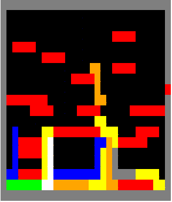
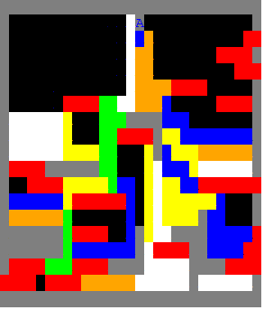
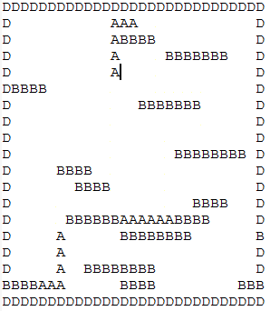

#Textoids:  Snake meets Tetris.
## A little elisp app that shows a "snake" dropping
## down, and bumping off "bricks".  It runs until the buffer
## fills up
## Screen Shots

## A completed buffer

## Textual mode:  Basically it's just a bunch of charactars behind the scene:

